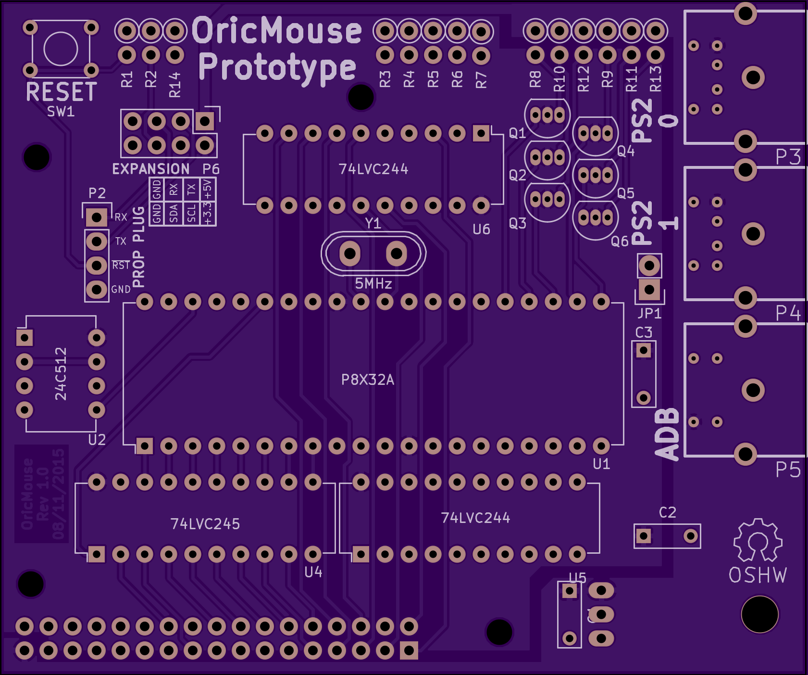
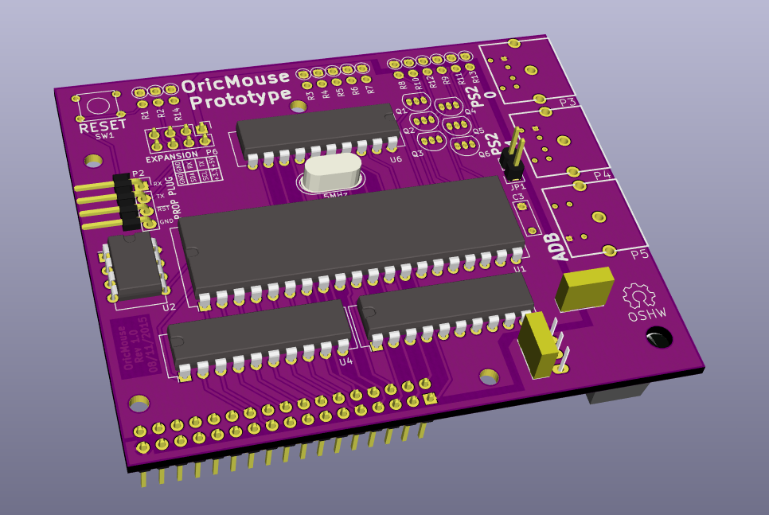
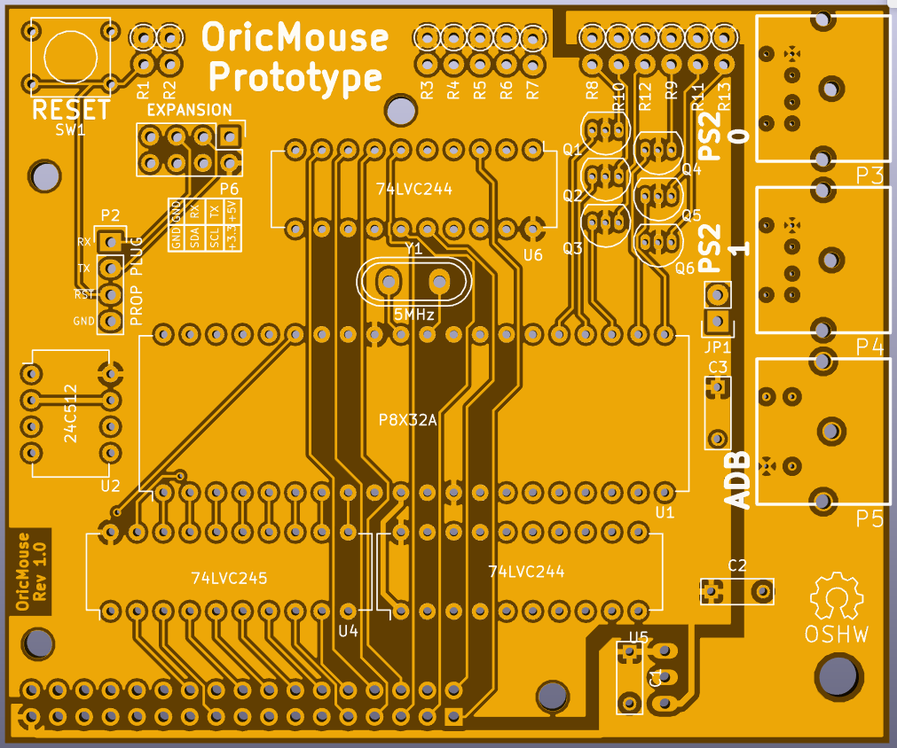

# OricMouse
OricMouse, an Expansion card to add Mouse to your Orices! (1, Atmos and Telestrat)

You will find both the hardware and firmware of this project in this repository. 

OricMouse is an Open Source Hardware project.

Ready to order gerber can be found on OSHPark: https://oshpark.com/shared_projects/KOAZTB95

The correct license still need to be choosen, but please concidere it currently as something similar to the 4 clause BSD, share and use as wanted, but always tell from what your project is based, and who is the original author.
__Also if you make your own derived project, do not use the same name or a derived name.__ That mean that you can use the Oric name as I don't own this name, but don't use "OricMouse".

3D Rendering of the PCB:

Older revision of the PCB:
